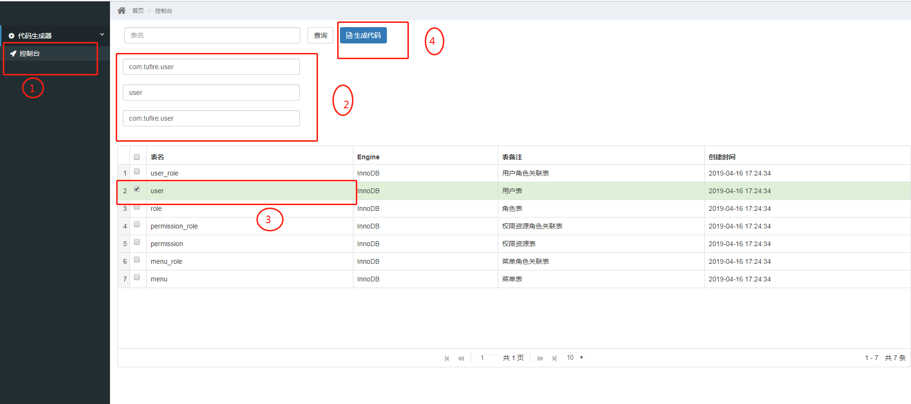

# Code Generator

## This is a code generator application. When we need to generate entities of database tables, we should make them generated automically. So how should we do? We can follow steps as bellow.

### 1.Change database connection in application.yml

### 2.Start our application, and visit url: http://localhost:8090/code-gen

* step 1: open the console
* step 2: input relative params
* step 3: choose tables that we want to generate
* step 4: click the button to generate code

### 3.Generate our entities, the result is a zip file.
